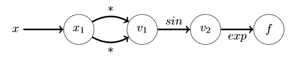

# Mountain-Bay Automatic Differentiation
- [Introduction](#introduction)
- [Background](#background)
- [How-To](#how-to-use-the-package)
- [Project Organization](#organization)
- [Implementation](#implementation)

## Introduction 
_what the problem solves and why it's important_
### Motivation
Differentiation, or the process of finding the derivative of a function, is a cornerstone operation in computational science, with applications in many other scientific disciplines. While there are several ways to program differentiation, automatic differentiation (AD) is the most efficient (linear in the cost of computing the value), while being numerically stable. 

The two common alternative methods to automatic differentiation are symbolic differentiation and finite difference. Though symbolic differentiation gives the exact number down to machine precision, it is computationally heavy and inefficient. Meanwhile, the finite difference method is a linear approximation, lacking machine precision, and is normally only used for testing. AD can handle complex functions while still returning accurate results. 

Therefore, AD is a particularly useful tool in calculating derivatives, finding applications in fields as varied as mathematical optimization to machine learning and AI. Optimization utilizes the roots of an equation to maximize or minimize a function, a concept used widely from physics, biology, and engineering to economics and business. Finding derivatives through AD, mostly in the form of gradients and Hessians, are ubiquitous in machine learning, computer vision, and AI. Additional AD application include computational fluid dynamics, atmospheric sciences, and physical modeling.

## Math Background
**Automatic Differentiation (AD)** is a method of finding the extrema of functions, This could be for optimization problems, to find the local maxima, or for minimization to find the roots. The key to AD is breaking down complicated functions to much simpler/more manageable functions using the major components that follow 
### Major Components
#### Chain Rule
The chain rule is as follows: 

For every function that can be defined as a composite of functions, one function acting on another but with respect to the same variable, here _t_:


The derivative of the composite function _f_ can be found by applying the derivative on the outer function _x_ with respect to _t_, and multiplying by the derivative of the inner function _y_ with respect to _t_:


This can be applied any number of times (), and is the core of automatic differentiation.

AD uses the chain rule to <>
#### The Gradient
When the variable isn't **scalar** (one dimensional) like the above, it is a **vector**. This comes from linear algebra and just means that we're working in multiple dimensions now.
What changes is not the function but the base variable. The _t_ from above becomes: 


To obtain the derivative of the composite function, we use what is called a _gradient_ denoted by  which contains all the partial derivatives of the function across the vector as so:


The chain rule applies here as well, so the gradient with respect to a vector _x_ of a given composite function _h = h(u(x))_ is the partial derivative of _h_ with respect to _u_ times the gradient of _u_


This can again be applied many times over on functions composed of composite functions, etc.

#### Elementary Functions
These are the base functions that have known (and therefore easy) derivatives, and from these functions all others are composed

Examples of these are: log, sin, polynomial, exp, etc

#### Evaluation Trace

Breaking down each function into its elementary functions can be called an evaluation trace, moving from inside out. 

It can be difficult to evaluate a composite function at any given value, so an evaluation trace follows the steps, evaluating the composite function at a given value from the most internal function moving out, so the most internal function is evaluated at the given input, and the function acting on that evaluates on the output, and so forth until the whole composite function is evaluated. Here's an example:


This function can be shown in a graph or as a trace table




| Trace | Operation | (_value_) |
| --- | --- | --- |
|  | x |  |
|  |  |  |
|  |  | 0 |
| _f_ |  | 1 |

### Embedded Derivative

The key to AD forward evaluation is the Evaluation Trace. This is Automatic Differentiation.

| Trace | Operation | Derivative | (_value, derivative_) |
| --- | --- | --- | --- |
|  | x | 1 |  |
|  |  |  |  |
|  |  |  |  |
| _f_ |  |  |  |

With the derivative embedded as we trace the evaluation of the function, we have an automatic differentiation process in the forward evaluation method. 

There is more to say to follow the reverse method, but for now we leave it.

## Usage instructions
Install package from PyPI:

`pip3 install <autodiff> # Package name to be decided on`

Once installed, you can instantiate functions used in the differentiation process.

This might look something along the lines of:

```
import autodiff as ad # Package name to be decided on
import numpy as np    # Base our variables on numpy

def f(x):             # Define a function
    y = np.pow(x, 2)  # y = x^2
    return y

f_prime = ad.grad(f)  # Calculate gradient function
print(f_prime(1))     # Calculate gradient at x = 1
```

Output of above code segment would be `2` (f'(x) = 2x and f'(1) = 2). 

The primary AD object will be `autodiff.grad`, as that serves as the backbone of autodifferentiation. More objects may be added as we have a clearer idea of implementation details (e.g. specifying forward v. reverse modes, returning Jacobians, etc).

## Organization 
The directory structure for our project is as follows, illustrated in tree format. Note that our modules are stored within src/ad-project/ folder. We also anticipate storing documentation, examples,  and our test suite in the appropriate folders, indicated by their names. Other than that, there are also the standard files we see in this type of repository: a README file, a license file, and a requirements file.
The structure: 

`
MountainBay/

    -AUTHORS.rst
    -CHANGELOG.rst
    -docs/
        -_static/
        -authors.rst
        -changelog.rst
        -conf.py
        -index.rst
        -license.rst
        -Makefile
    -LICENSE.txt
    -README.rst
    -requirements.txt
    -setup.cfg
    -setup.py
    -src/
        -ad_project/
            -__init__.py
            -skeleton.py
            -AD_Object.py
            -AD_BasicMath.py
        -AD_project.egg-info/
            -dependency_links.txt
            -not-zip-safe
            -PKG-INFO
            -requires.txt
            -SOURCES.txt
            -top_level.txt
    -tests/
        -conftest.py
        -test_skeleton.py
`		
    We have created two modules, AD_Object and AD_BasicMath.  Our first module is called Var, and is stored under the module 'AD_Object'. This module instantiates an Automatic Differentiation (AD) Object to be used in a forward or reverse mode. It takes in a value and derivative, and returns our AD Object with new values and derivatives. In AD_Object, we perform operation overload for methods such as addition, subtraction, multiplication, division, power and negation. The second module is be AD_BasicMath. This module contains trigonometric functions such as sin, cos, tan, exponential functions, log and natural log functions. This allows us to carry out a variety of methods on our AD Object beyond the basic functions that we have overloaded. 
    We used the framework PyScaffold, because it sets up a folder system for us and incorporates Sphinx, which builds documentation. The directory structure set up by PyScaffold is illustrated above, with our own modules for AD_Object and AD_BasicMath included. We wrote out documentation and examples for each module. We also wrote tests, which live within the 'test' folder, and continued to use TravisCI and CodeCov.
    This package will be distributed on PyPI, which allows users to upload packages. First, we will wrap our code into distribution packages using wheel and setuptools. We will test our package in order to ensure that all the necessary packages and files are included; Twine will be used in order to also assure that our package description will render accurately on PyPI. We will upload to TestPyPI to check if everything is functioning properly, and if so, we will then upload our package to PyPI using Twine.


## Implementation
Core data structures:

    The core data structures we anticipate using are matrices (ex. Jacobian), vectors (ex. seed vector), lists, tuples, and/or dictionaries for storing information.

What classes will you implement?

    We will be implementing a class that takes in a derivative and a value as input, and outputs an object for every calculation.
    We will also be implementing a class containing basic arithmetic operations.

What method and name attributes will your classes have?

    The class AD_Object will create our Auto Differentiation Object and have all operation overload for basic functions such as addition, subtraction, multiplication, division, and power. The class AD_Num contains trigonometric functions, exponential functions, and more. 

What external dependencies will you rely on?

    We will be using numpy because of its mathematical capabilities and pandas, since it has an easy to use interface and fast data structures..
    
How will you deal with elementary functions like sin, sqrt, log, and exp (and all the others)?

    These elementary functions will be contained within their own module, AD_BasicMath.
    
## Future Features
	For our next step, we propose to incorporate a reverse mode implementation into our project. While the forward mode is efficient for functions with few inputs and many outputs, the reverse mode is ideal for functions with many inputs and few outputs. Part of our future features thus will include taking in vector inputs and returning vector outputs. 

    The reverse mode is composed of two steps: a forward pass and a reverse pass. The forward pass evaluates the elementary functions and stores the partial derivative, but does not do the chain rule. The reverse pass begin with evaluating Vbar = (df/dVn) = 1, because f = Vn. It then works backwards to evaluate the derivatives, adding values when a node has multiple children (implementing the chain rule). Note: while the forward mode calculates the Jacobian-vector product, the reverse mode actually calculates the Jacobian transpose-product. Currently, we anticipate doing this by constructing a graph of nodes that represents our original expression as the program runs. This means an input x and/or y would be the root of such a graph, and we would now think of Var as creating nodes that have children. Whenever a new expression is built out of current nodes, that new expression would be a child of each of those current nodes. This would also save contributing weights for gradient computation later on. We would then propagate derivatives using recursion.
    
    In addition, we want to add the ability to allow for vector inputs.
